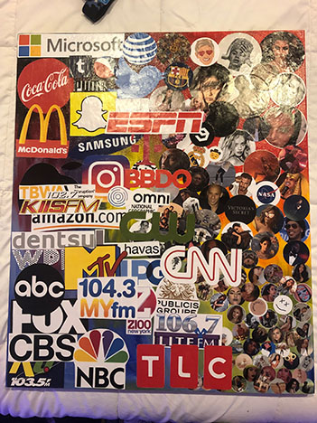

###Internet Influencers

The term Internet Influencer was coined around 2010 when Jenna Marbles, Shane Dawson, Pewdiepie, and many more started to gain some fame on social media.
Internet influencers are the new celebrities of the 21st century. In the past twenty years social media has boomed with millions of people making accounts and living online. Most recently Internet influencers have become the new talk of the town. Internet Influencers essentially share their life online, either it be through photos, videos, or comments. The primary social media platforms are YouTube, Instagram, Twitter, and Facebook.The main demographic of their followers depends on the type of content they produce. These online influencers give people a personal glimpse into their lives. It is like being personal with a person without even meeting them in real life. This can benefit the viewer but also impair them. The viewer feels closer to them because they are more reachable then an average celebrity.Unfortunately, the viewers sometimes get way to invested into these influencers and then do not develop the social skills they need because influencers are so personal and reachable. Over time we will see the social effects on the younger generation.  
There are different types of social media influencers like micro influencers, celebrity influencers, and character influencers. Influencers are also known for promoting unreachable body types because of how much they alter their body with photoshop and facetune. Their audience thinks this is the standard that they need to get to in order to have followers, be pretty, and or be accepted into society. Anna Russett who is a seasoned internet influencer states, “Social media can be damaging to mental health and body image/self perception.” Influencers have a lot of power online, sometimes this can be a bad thing. There have been many deaths from the influence of people online. The main cause to all of this is online challenges that these influencers promote like the cinnamon challenge or even more horrifying the Momo challenge.
The social media platforms use a system so the influencer can make a living. Adcents and endorsements. Influencers get paid up to a couple of thousand dollars just to post one picture of a product. What is so amazing about this way of advertising is that their followers are most likely going to spend their money. Regular celebrities endorse products all the time but internet influencers have a better chance of getting their audience engage because of how personal and reatable they are. Adcents is based on how many views/clicks a the ad gets. Some influencers do for the money and other just do it because they love what they do.

*Internet food chain, May 3, 2019, glue/wood/acrylic paint/printer paper, dimensions (22 x 18 )

I chose to take a picture of my final project because it is the only way I could document it. From the last photo you saw about my piece I did not have a lot on the canvas. I printed out more pictures and collaged them together to make my work.*
