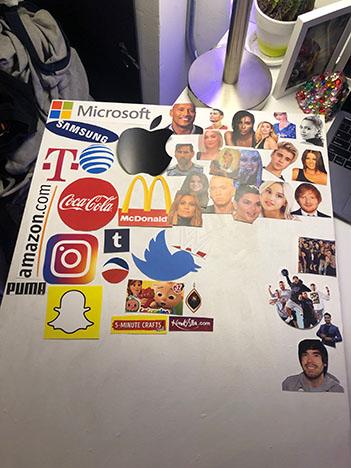

#in_progress

This is a picture of me trying to figure out where I should put images in the collage I was working on. The only way I could document this would be to take a picture. I then later on paint the whole canvas with different colors so I wouldn’t have a plain white background.

May 2, 2019, Materials: wood, glue, paper, acrylic paint, Dimensions (22 x 18 )
