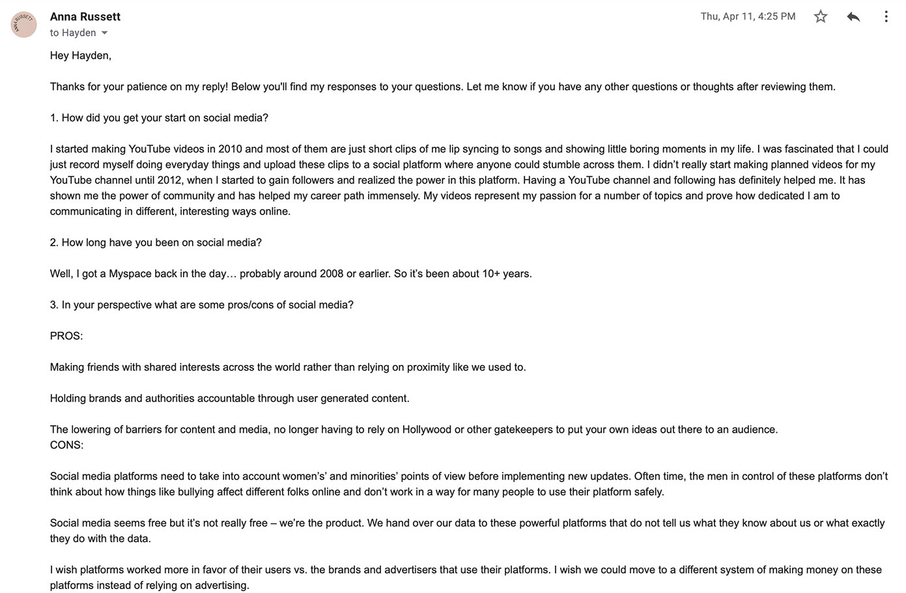

#Research

I chose to document my research this way because it is how I could interview Anna Russet. I was not able to meet her unperson so taking a screen shot of the conversation was the most reasonable. I also took a picture from some notes that where written on the board which I could base my art piece on.

April 11, 2019, email , dimensions (0 x 0 x 0)
